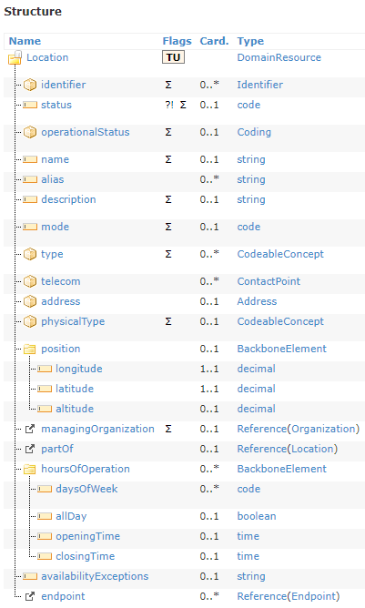

# Fhir Location Vaccination

This project was created using [Angular CLI](https://github.com/angular/angular-cli) version 11.2.3.

Hosted on [https://fhir-location-1daf4.firebaseapp.com/home](https://fhir-location-1daf4.firebaseapp.com/home)

## FHIR Location standard

Based on the [FHIR Location](http://www.hl7.org/fhir/location.html) standard.



The app does not implement the full standard only parts that together form a usable application.
The following Interface got implemented in the application:

```ts
export interface Location {
    id?: string,
    status?: Status,
    operationalStatus?: OperationalStatus,
    name: string,
    description?: string,
    type?: Type[],
    telekom?: ContactPoint,
    address: Address,
    physicalType?: PhysicalType,
    managingOrganization?: string,
    partOf?: string
}
```

Variables with the "?" postfix are optional and types like "Status" or "ContactPoint" are custom sub-types defined in the model.
The main purpose of the application is to understand the basics of Web frameworks, Angular, and Firebase.

## Development server

After cloning the project run `npm i` in the source folder. Run `ng serve` to start the development server. Navigate to `http://localhost:4200/`

## Hosting

The app is hosted on free tier Firebase hosting and gets auto deployed through GitHub Workflow.